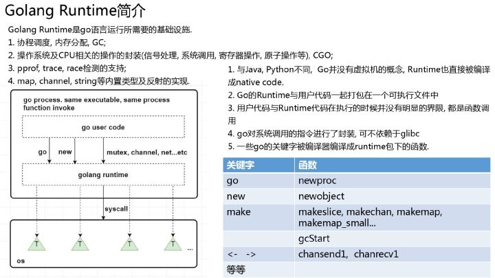

Golang Basic Knowledge 

12.
golang的map涉及到两个底层结构体——hmap和bmap
bmap也叫bucket，bucket就是存储数据的键—值的数据结构，底层采用链表形式存储，每个bmap中还会存储一个overFlow指针，用于扩容时指向下一个bmap

13.
设计者有意为之，因为map有双倍扩容和等量扩容两种方式，在等量扩容后，key可能从原有的桶移动到另外的桶中
如果想有序遍历，把所有key拿出来排序就行了，空间与时间复杂度都是N

14.
直接对基本的map进行多协程操作，会触发panic
并发安全的map，直接使用sync.Map就行

15.
在要查找的对象不存在时，第一个出参是对应类型的0值，第二个出参是false
d, ok := m["key"]
d := m["key"]
基本查找时，用hash的低B位定位桶的位置，用高8位来定位桶内key的位置，过程如下：

16.
空间换时间，相当于为map多封装了一个read变量和互斥锁，适用于读多写少的场景
type Map struct {
   mu Mutex
   read atomic.Value // readOnly
   dirty map[interface{}]*entry
   misses int
}

17.
channel有两种类型：有缓冲和无缓冲
channel有三种模式：读通道、写通道和

channel有三种状态：未初始化、关闭和正常开启

一个 channel不能多次关闭，会导致painc
如果多个 goroutine 都监听同一个 channel，那么 channel 上的数据都可能随机被某一个 goroutine 取走进行消费
如果多个 goroutine 监听同一个 channel，如果这个 channel 被关闭，则所有 goroutine 都能收到退出信号

18.从设计的角度，channel本来使用的场景就是多协程，所以必须支持线程安全
channel的底层采用了Mutex来保证读写安全

19.
无论是通过共享内存来通信还是通过通信来共享内存，最终我们应用程序都是读取的内存当中的数据，只是前者是直接读取内存的数据，而后者是通过发送消息的方式来进行同步。而通过发送消息来同步的这种方式常见的就是 Go 采用的 CSP(Communication Sequential Process) 模型

大部分的语言采用的都是第一种方式直接去操作内存，然后通过互斥锁，CAS 等操作来保证并发安全。Go 引入了 Channel 和 Goroutine 实现 CSP 模型将生产者和消费者进行了解耦，Channel 其实和消息队列很相似。
优点：使用 channel 可以帮助我们解耦生产者和消费者，可以降低并发当中的耦合
缺点：容易出现死锁的情况

20.
死锁：
单个协程永久阻塞
两个或两个以上的协程的执行过程中，由于竞争资源或由于彼此通信而造成的一种阻塞的现象。

channel死锁场景：
非缓存channel只写不读
非缓存channel读在写后面
缓存channel写入超过缓冲区数量
空读
多个协程互相等待

21.
读写顺序不同，
无缓冲的必须先读后写
有缓冲的可以先写再读，也可以先读在写

22.compare and swap是一种典型的无锁线程同步控制方法
有一个地址V，期望值是A，交换值是B
通过将V的当前值来与A做比较，如果不变，就交换为B
CAS通常是CPU原子操作，不会被打断

但是CAS仍存在ABA问题，解决方法是增加版本号控制。

23.互斥锁Mutex和读写锁RWMutex，两种都属于悲观锁

24.互斥锁在加锁时，底层使用了cas和自选锁两种方式

25.goroutine是用户态下的轻量级线程，由golang的runtime管理，

26.runtime可以理解成golang进程的内置调度器，负责协程调度、GC、pprof支持等等

// https://zhuanlan.zhihu.com/p/95056679

27.
初始内存占用不同；
创建和销毁的管理不同
上下文切换成本不同

28.
Goroutine 内进行channel/mutex 等读写操作被一直阻塞。
Goroutine 内的业务逻辑进入死循环，资源一直无法释放。
Goroutine 内的业务逻辑进入长时间等待，有不断新增的 Goroutine 进入等待

具体的典型场景有：
channel未初始化，读写阻塞
channel的发送方数量和接收方数量不一致，造成阻塞
http响应的body没有关闭，goroutine也不会退出
协程加锁未释放，导致后续协程一直加锁阻塞
waitgroup的add和done的数量不一致    

排查方法是：
单个函数内部可以使用runtime.NumGoroutine来获得当前函数的协程数量
整个进程一般使用pprof工具进行监测

29.使用pprof工具

30.

